# Smart Student Grouping

AI-Powered Team Formation for Educators

Optimizing collaborative learning through intelligent student grouping

GUTs - Generative Untrained Transformers

Marcelo Mollaj | Giorgos Topsis

---

# The Problem

Teachers **manually** or **randomly** grouping students

- Difficult to balance multiple criteria simultaneously
- Random or intuition-based grouping leads to imbalanced teams
- Hard to track what works and replicate successful groupings
- Results in poor team dynamics and frustrated students

---
layout: two-cols
layoutClass: gap-12
---

# Solution

Our platform uses **AI** to **intelligently** group students based on **customizable** questionnaires

Flow:

1. Create Questionnaire & Set Weights

2. Students Respond

3. AI Grouping

4. Review & Adjust

Example: Educational treasure hunt with problem-solving: 5, teamwork: 4, creativity: 3, leadership: 2

::right::

```mermaid {scale: 0.6}
flowchart TD
    T[👩‍🏫 Teacher] --> QC[Questionnaire Creation<br/>AI Assisted or Manual]
    QC --> DIST[Share and Distribute<br/>QR Code or Link or Print]
   
    ST[👨‍🎓 Students] --> DIST
    DIST --> RESP[Student Response<br/>Fill and Submit]
   
    RESP --> AI[AI Processing<br/>Analyze and Generate Groups]
    T --> AI
    AI --> GR[Optimized Groups]
   
    GR --> T
```

---
layout: center
class: text-center
---

# Demo

💻

Let's see the platform in action

